      <!---------------------------------
				HARDWARE
			----------------------------------->
      

        

          

            <h1><a name="hardware">Hardware</a></h1>
          

        

        

          

            <a href="https://system76.com/laptops/oryx" target="_blank">
              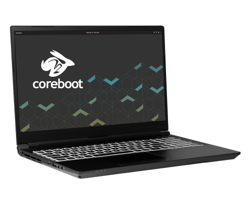
            </a>
          

          

            <h2>Laptop: System76 Oryx Pro 7</h2>
            

              I was looking for a Linux laptop that I could use for development,
              general productivity, and gaming over the next couple of years.
              While I love my desktop and my ultrabook laptop, I really wanted
              one device that could fill both roles. After doing some research,
              I landed on
              <a href="https://system76.com" target="_blank">System76</a>. They
              are a U.S. based company that specializes in selling Linux
              laptops, desktops, and servers. They also make their own Linux
              distribution in
              <a href="https://pop.system76.com" target="_blank">Pop!_OS</a>. Of
              their available laptops, the
              <a href="https://system76.com/laptops/oryx" target="_blank"
                >Oryx Pro</a
              >
              lineup seemed to be the best balance of portability, power, and
              hybrid graphics. The last point is especially important to me
              because I want to be able to extend battery life by turning off
              the discrete GPU when I don't need it. Overall, I am very happy
              with my purchase. For more information, check out my
              <a href="./blog_oryx_pro_review.html">review</a>.
            

          

        

        

          

            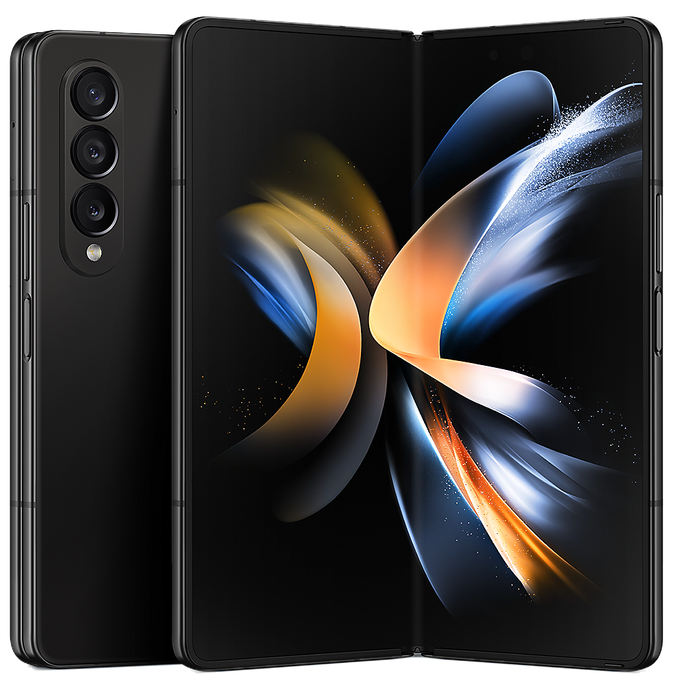
          

          

            <h2>Phone: Samsung Galaxy Z Fold 4</h2>
            

              I was originally really hesitant about getting a folding phone
              given some of the quality control issues with the early
              generations of the Galaxy Z Fold, but the 4th is really where
              Samsung refined their design to the point that I think it is ready
              for the mainstream. I upgraded to this from a Galaxy S10+, which I
              absolutely loved. However, this device is a step above even the
              top of the line slab style phones. The versatility of having an
              almost full size phone when folded, and an amazing tablet when
              unfolded is unmatched by the competition (at least in the U.S.
              market). Multi tasking and content consumption on the big screen
              is absolutely amazing. No longer do I need to pull out a big and
              clunky tablet (like the Microsoft Surface Go I had before) to
              watch a movie. Now, I just pull out my phone and unfold it into a
              screen that is plenty big enough to watch whatever I want.
              Sometimes, I even watch a live sports match while multi-tasking
              with stats on a second app. This kind of functionality will
              definitely cost you, but given that it can replace two devices,
              can fit in your pocket, and supports the S-pen, I can absolutely
              recommend this device for anyone looking to upgrade to a folding
              phone.
            

          

        

        

          

            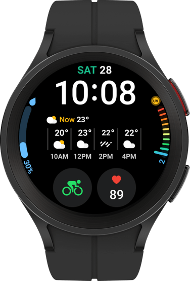
          

          

            <h2>Watch: Samsung Galaxy Watch 5 Pro</h2>
            

              With the Samsung Galaxy Watch 5 Pro (and some older devices),
              Samsung partnered with Google to build a new version of Wear OS.
              Now, you get the amazing user experience from Samsung's old Tizen
              OS with all the app support of Google's Wear OS. The Watch 5 Pro
              drops the mechanical bezel that I loved on my old Galaxy Watch,
              but the capacitive bezel is perfectly fine. Battery live is
              decent, but nothing special in my experience. I can usually get a
              little more than a full day's worth of battery even with the
              always on display activated. It charges pretty quickly though, so
              I've never had an issue as long as I charge it for a bit every
              morning before leaving for the day. If you're an Android phone
              user, I can absolutely recommend this device. Especially if you
              have a samsung phone.
            

          

        

        

          

            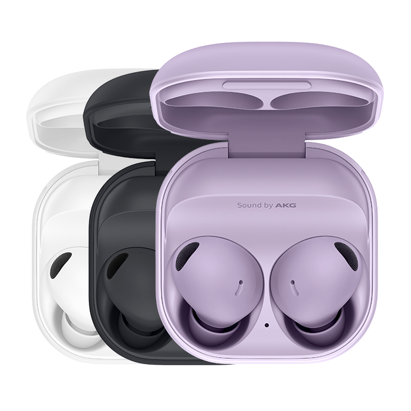
          

          

            <h2>Wireless Earbuds: Samsung Galaxy Buds 2 Pro</h2>
            

              Upgraded to the Galaxy Buds 2 Pro along with the Galaxy Watch 5
              Pro when I bought the Z Fold 4 as a part of a bundle. I was
              running into battery issues with my old Galaxy Buds, so these have
              been a welcome improvement. Audio quality is good enough for my
              needs, but nothing special considering the physical limitations of
              in-ear bud style audio products. Haven't had any issue with
              battery life as I generally don't use them long enough to burn
              through the entire battery. Even if you do, you can pop them back
              into the case which will charge them. Haven't done any significant
              testing with mic quality, but haven't had issues taking calls on
              them. I love that they come with noise cancelling and audio
              passthrough, so you can hear your surroundings when walking around
              outside and block out the noise when working.
            

          

        

        

          

            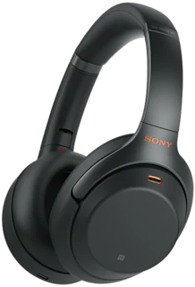
          

          

            <h2>Wireless Headphones: Sony WH-1000XM4</h2>
            

              I previously purchased the WH-1000XM2's, but decided to upgrade
              after seeing the XM4's on sale. The XM4's are an improvement in
              every way and well worth the price. Sound quality is amazing,
              noise cancelling is excellent, and it has audio passthrough in
              case you need to hear your environment. If you need wireless
              bluetooth headphones, this is it. My favorite feature is
              definitely the ability to connect to two devices (e.g. laptop and
              phone) at once. This means I can answer a call on my phone while
              listening to music on my laptop without having to completely
              disconnect and reconnect. If you want to use the better sounding
              LDAC codec, you will only be able to connect to one device at a
              time. This is a worth while tradeoff in my opinion considering how
              much better everything sounds. I also really like the battery
              life. Sony reports 30 hours of charge. If you will be away from an
              outlet for an extended period of time and plan on using your
              headphones a lot, these are great.
            

          

        

        

          

            
          

          

            <h2>Mechanical Keyboard: Keychron Q1 Pro</h2>
            

              I've always been interested in custom mechanical keyboards, but
              never enough to really dive into the hobby. This changed recently
              and I decided to look into buying a pre-built base board with
              solid build quality, an option to connect wirelessly, media
              controls (e.g., volume knob), hot swappable switches, and keymapping software that works
              on Linux. After some searching, I came across the Keychron Q1 Pro,
              which is the wireless version of the much loved Keychron Q1. I
              haven't really tried any mechanical switches before, so I went
              with
              <a
                href="https://www.keychron.com/products/gateron-cap-switch-set?variant=40119285284953"
                target="_blank"
                >Gateron Browns</a
              >
              which have a tactile bump, but aren't too loud. These are quiet
              enough to be used in an office setting or during a call while
              still being satisfying to type on. The switches definitely aren't
              as clicky as my old Razer Huntsman Elite, which I see as a plus.
              It takes a little bit of getting used to, but I absolutely love
              them now. For the keycaps, I went with
              <a
                href="https://www.keychron.com/products/cherry-profile-double-shot-pbt-full-set-keycaps-player"
                target="_blank"
                >Cherry Profile Double-Shot PBT Full Set Keycaps - Player</a
              >
              from Keychron. These look absolutely amazing (in my opinion), but
              I'm sure I'll look into other sets when they come back in stock in
              the future. I also love that this is a 75% keyboard. It has just
              enough keys for some special functions I use on my computer and
              gives me a bunch of desk space back.
            

          

        

      

      <!---------------------------------
				VIDEO GAMES
			----------------------------------->
      

        

          

            <h1><a name="video_games">Video Games</a></h1>
          

        

        

          

            <h2>Favorite Games</h2>
            

              These are a couple of my all-time favorite video games (of the
              ones I have played), organized by platform. I haven't necessarily
              completed all of them, but these are the ones that I enjoyed the
              most or found the most memorable. Some cross-platform games that I
              previously played on other systems, like Xbox 360, have since been
              re-purchased on PC. I have listed these cross-platform games under
              PC (even if played elsewhere) since this is currently my primary
              gaming platform.
            

            

              From the platforms listed below, you may be wondering about some
              notable omissions like The Legend of Zelda: Breath of the Wild,
              Bloodborne, God of War, Fallout: New Vegas, Portal 2, etc. While I
              do own these and have played them, I never really got past the
              first few hours for one reason or another. I do intend to return
              to these (at least the ones available on PC) when I find time and
              will update this list accordingly.
            

            

              I have started using
              <a href="https://www.grouvee.com" target="_blank">Grouvee</a> to
              track my video game collection as it has a nice interface, is
              free, has metadata for tons of games (across multiple platforms),
              and has great social features. You can check out
              <a href="https://www.grouvee.com/user/sr98vn/" target="_blank"
                >my profile on Grouvee</a
              >
              to see a (somewhat) full list of games I have played, am currently
              playing, or am interested in playing.
            

          

        

        

          

            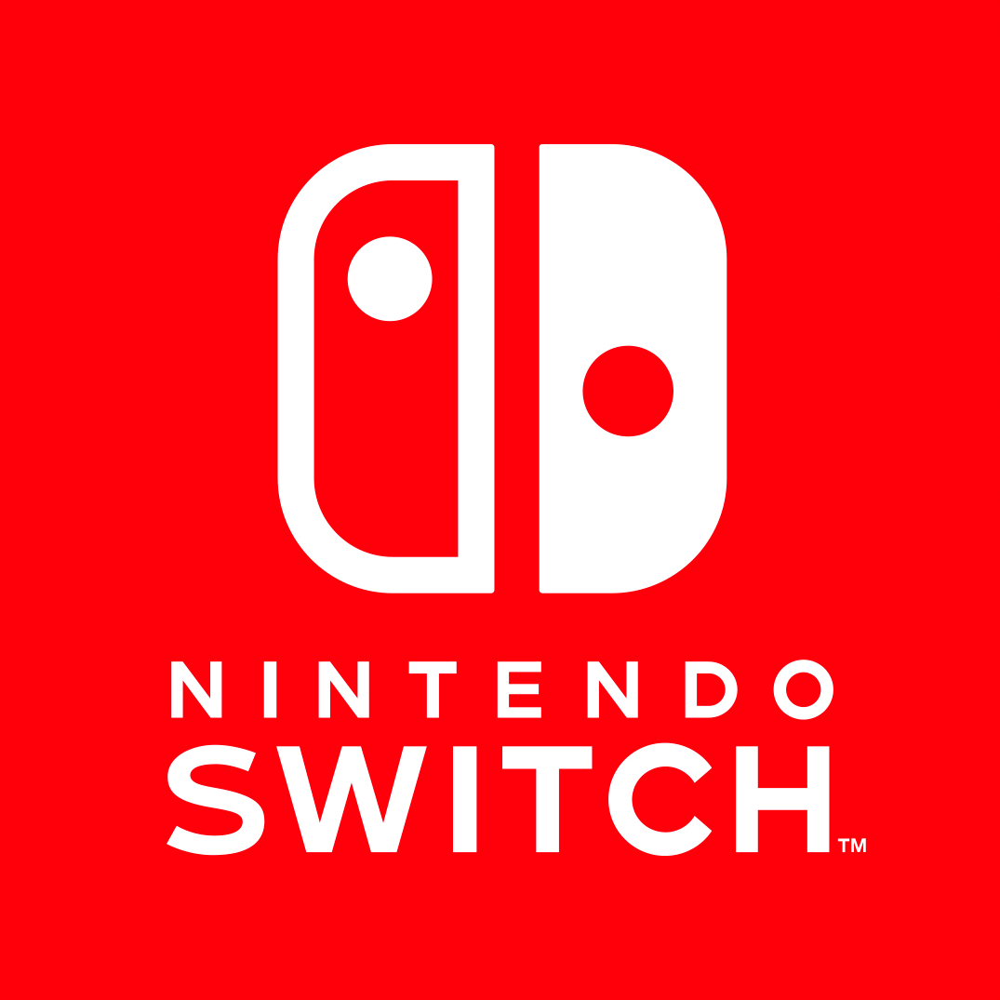
             
            <ul>
              <li>Animal Crossing: New Horizons</li>
              <li>Fire Emblem: Three Houses</li>
              <li>Mario Kart 8 Deluxe</li>
              <li>Super Smash Bros. Ultimate</li>
            </ul>
          

          

            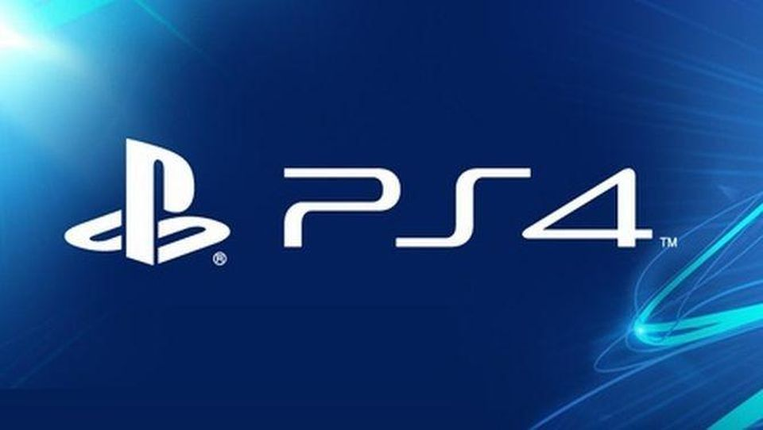
             
            <ul>
              <li>Marvel's Spider-Man</li>
            </ul>
          

          

            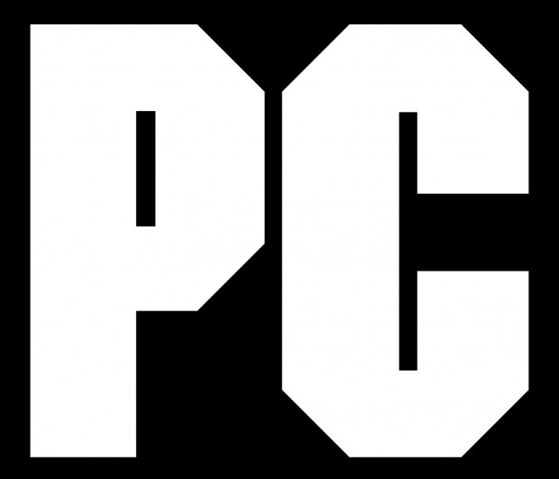
             
            <ul>
              <li>Assassin's Creed II</li>
              <li>Batman: Arkham City</li>
              <li>Borderlands 2</li>
              <li>Dark Souls - 1 (Remastered) & 3</li>
              <li>Dishonored - 1 & 2</li>
              <li>Dragon Age: Inquisition</li>
              <li>Dragon Quest XI: Echoes of an Elusive Age</li>
              <li>Fallout 4</li>
              <li>Far Cry 3</li>
              <li>Grand Theft Auto V</li>
              <li>Just Cause 2</li>
              <li>Mass Effect Legendary Edition</li>
              <li>Middle-Earth - Shadow of Mordor & Shadow of War</li>
              <li>Minecraft</li>
              <li>Red Dead Redemption - 1 & 2</li>
              <li>Star Wars: Jedi Fallen Order</li>
              <li>The Elder Scrolls V: Skyrim</li>
              <li>The Sims 3</li>
              <li>The Witcher III: Wild Hunt</li>
              <li>Titanfall 2</li>
              <li>Watch Dogs 2</li>
              <li>Yakuza: Like a Dragon</li>
            </ul>
          

        

      

      <!---------------------------------
				PODCASTS
			----------------------------------->
      

        

          

            <h1><a name="podcasts">Podcasts</a></h1>
          

        

        <!-- Hardcore History -->
        

          

            
          

          

            <h2>
              <a href="https://pca.st/hardcorehist" target="_blank"
                >Dan Carlin's Hardcore History</a
              >
            </h2>
            

              This is long-form historical discussion and analysis. If you are
              interested in diving deep into historical events from the
              perspective of someone who knows how to tell a story, this is the
              podcast for you. Episodes are generally 4 to 5 hours long and
              aren't released very often as they require an enormous amount of
              research.
            

          

        

        <!-- Decoder -->
        

          

            <a href="https://pca.st/decoder" target="_blank">
              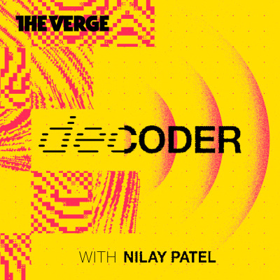
            </a>
          

          

            <h2>
              <a href="https://pca.st/decoder" target="_blank"
                >Decoder with Nilay Patel</a
              >
            </h2>
            

              This is a podcast about big ideas and other problems. Verge
              editor-in-chief Nilay Patel talks to a diverse cast of innovators
              and policy makers on the frontiers of business and technology to
              reveal how they're navigating an ever-changing landscape, what
              keeps them up at night, and what it all means for our shared
              future. This is one of my favorite interview style podcasts
              because Nilay does a great job of asking tough questions of his
              interviewees and explaining complex things in an easy to
              understand way.
            

          

        

        <!-- Football Weekly -->
        

          

            
          

          

            <h2>
              <a href="https://pca.st/footballweekly" target="_blank"
                >Football Weekly</a
              >
            </h2>
            

              I love the light-hearted and sometimes comedic news & review of
              European football matches. The rotating cast of football
              journalists and long-time hosts are thoroughly enjoyable to listen
              to every week. Definitely recommend this podcast for any football
              (soccer) fans.
            

          

        

        <!-- Missed Apex F1 -->
        

          

            
          

          

            <h2>
              <a href="https://pca.st/cz12" target="_blank"
                >Missed Apex F1 Podcast</a
              >
            </h2>
            

              The
              <a href="https://www.netflix.com" target="_blank">Netflix</a>
              documentary series
              <a href="https://www.netflix.com/title/80204890" target="_blank"
                >Formula 1: Drive to Survive</a
              >
              really piqued my interest in motorsport. As I started to follow
              the 2021 F1 season more intently (especially the dramatic and
              controversial finale in Abu Dhabi), I found the Missed Apex F1
              podcast. The hosts are very entertaining and provide detailed
              analysis and opinions of each race and the season as a whole. If
              you are interested in following F1, I definitely recommend
              checking this podcast out.
            

          

        

        <!-- Throughline -->
        

          

            <a href="https://pca.st/lmm1" target="_blank">
              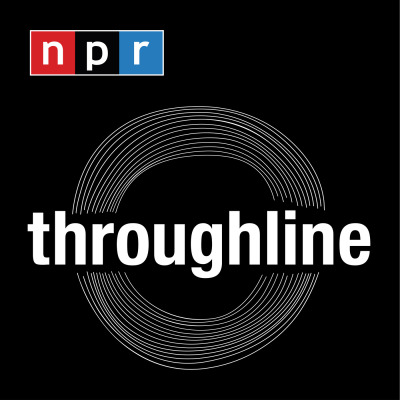
            </a>
          

          

            <h2>
              <a href="https://pca.st/lmm1" target="_blank">Throughline</a>
            </h2>
            

              The premise of Throughline is exploring how we can look at the
              past to understand the present. The hosts are awesome and always
              find very interesting stories in the past relating to current
              events that help put things in perspective.
            

          

        

        <!-- Vergecast -->
        

          

            <a href="https://pca.st/vergecast" target="_blank">
              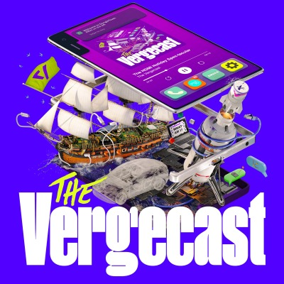
            </a>
          

          

            <h2>
              <a href="https://pca.st/vergecast" target="_blank"
                >The Vergecast</a
              >
            </h2>
            

              The Vergecast is perhaps my favorite podcast of any genre. The
              hosts discuss the week's tech news and other nerdy topics as well
              as interviews with tech leaders. Cannot recommend this enough.
            

          

        

        <!-- WWDTM -->
        

          

            <a href="https://pca.st/nprwaitwait" target="_blank">
              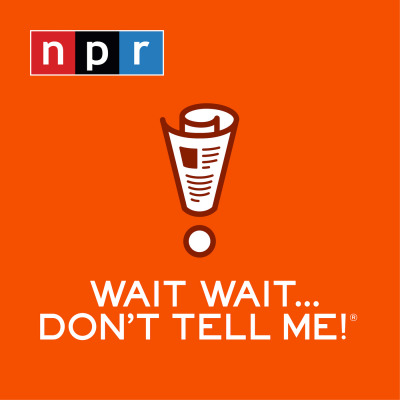
            </a>
          

          

            <h2>
              <a href="https://pca.st/nprwaitwait" target="_blank"
                >Wait Wait... Don't Tell Me!</a
              >
            </h2>
            

              This is my favorite news/comedy podcast. I love hearing about the
              week's wacky stories and the rotating panel of comedians' opinions
              on world events.
            

          

        

      

      <!---------------------------------
				MUSIC
			----------------------------------->
      

        

          

            <h1><a name="music">Music</a></h1>
          

        

        

          

            <h2>Spotify Playlist</h2>
            
These are my current (approximately 100) favorite songs.

          

        

        

          

            <iframe
              src="https://open.spotify.com/embed/playlist/28Qjnry0Pw8D6Z6n5pzxSv"
              width="100%"
              height="580"
              allowtransparency="true"
              allow="encrypted-media"
            ></iframe>
          

        

      

    

  </body>

  <footer>
    
  </footer>
</html>